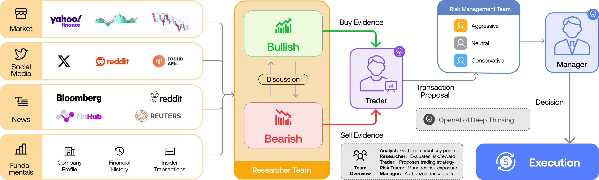

# AI Trading Analysts Team

A web chat interface for [TradingAgents](https://github.com/TauricResearch/TradingAgents), a multi-agent
LLM pipeline that analyzes a stock ticker the way a real trading desk would: a team of analysts gathers
data, two researchers debate the bull and bear case, a trader drafts a position, a risk team stress-tests
it, and a portfolio manager delivers the final call. This project wraps that pipeline in a FastAPI backend
and a Next.js chat UI, so the whole multi-agent run streams live in the browser instead of a terminal.

<p align="center">
  
</p>

## What you get

Type a ticker into the chat (`AAPL`, or `analyze NVDA 2026-08-20`) and watch six agents report in as they
finish, ending with a final rating — **Buy / Overweight / Hold / Underweight / Sell** — and the full
reasoning behind it.

| Agent | Role |
|---|---|
| Market Analyst | Technical indicators (RSI, MACD, ...) over a configurable look-back window |
| Sentiment Analyst | News, StockTwits, and Reddit chatter aggregated into a sentiment read |
| News Analyst | Global macro news and headline events relevant to the ticker |
| Fundamentals Analyst | Financials, valuation, and growth metrics |
| Research Manager | Resolves a structured bull/bear debate into an investment plan |
| Trader → Risk Team → Portfolio Manager | Turns the plan into a transaction proposal, stress-tests it from three risk postures, and issues the final rating |

## Architecture

```
frontend/  Next.js (App Router, TypeScript, Tailwind) — single chat page, EventSource-driven
backend/   FastAPI — bridges the synchronous LangGraph pipeline into a Server-Sent Events stream
tradingagents/  the underlying multi-agent framework (see below)
```

The backend's `GET /api/analyze?ticker=...&date=...` endpoint runs the LangGraph pipeline in a background
thread and streams three event types over SSE as they happen: `agent_done` (one per completed analyst,
with its report), `final` (the rating + full decision writeup), and `error`. The frontend's
`useAnalysisStream` hook consumes that stream and renders each report as it lands — no polling, no
terminal, no console interaction anywhere in the flow.

## What's customized vs. upstream TradingAgents

This is a fork of TauricResearch/TradingAgents with the following changes layered on top, all in
[`backend/app/config.py`](backend/app/config.py) so the original CLI (`tradingagents` / `python -m cli.main`)
is untouched and keeps its own defaults:

- **LLM provider**: OpenAI (`gpt-5.5` for decision nodes, `gpt-5.4-mini` for analysts) instead of the
  upstream default. Swappable back to Groq or any other supported provider via `BACKEND_LLM_PROVIDER`.
- **News vendor**: [Exa](https://exa.ai) neural search (`tradingagents/dataflows/exa.py`) instead of
  yfinance-only news, with yfinance kept as an explicit fallback.
- **Reddit and StockTwits** sentiment sources are unchanged from upstream (Exa has no social-media coverage).
- **Polymarket removed** from the News Analyst's toolset — it's still implemented in
  `tradingagents/dataflows/polymarket.py` for anyone who wants to re-enable it, just not wired into the
  pipeline by default here.
- **Token-budget knobs** (`max_indicators`, `max_indicator_lookback_days`, `news_article_limit`,
  `global_news_article_limit`) — added to `tradingagents/default_config.py` so a rate-limited provider
  (e.g. Groq's free tier, capped at 8,000 tokens/minute) can run the full pipeline without hitting 413s.
  They default to the repo's own full-depth values and only need lowering on a capped provider.

## Running it locally

**Backend**
```bash
cd backend
pip install -r requirements.txt
cp .env.example .env   # fill in OPENAI_API_KEY and EXA_API_KEY
uvicorn app.main:app --port 8000
```

**Frontend**
```bash
cd frontend
npm install
npm run dev
```

Open `http://localhost:3000` and send a ticker.

## Credit

Built on top of [TauricResearch/TradingAgents](https://github.com/TauricResearch/TradingAgents) — see
that project for the original CLI, the full provider matrix (Google, Anthropic, xAI, DeepSeek, Qwen, GLM,
MiniMax, Ollama, Bedrock, Azure, and more), and the underlying research. If you use this work, please cite
the original paper:

```
@misc{xiao2025tradingagentsmultiagentsllmfinancial,
      title={TradingAgents: Multi-Agents LLM Financial Trading Framework},
      author={Yijia Xiao and Edward Sun and Di Luo and Wei Wang},
      year={2025},
      eprint={2412.20138},
      archivePrefix={arXiv},
      primaryClass={q-fin.TR},
      url={https://arxiv.org/abs/2412.20138},
}
```

> TradingAgents is designed for research purposes. It is not intended as financial, investment, or
> trading advice. See the [disclaimer](https://tauric.ai/disclaimer/).
